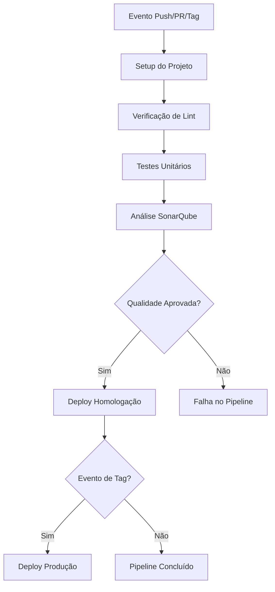

# Calculadora API - Projeto de Teste CI/CD

[](https://drone.io)
[](https://nodejs.org)
[](https://developer.mozilla.org/docs/Web/JavaScript)
[](https://www.sonarqube.org/)

Este projeto é uma API de calculadora desenvolvida em Node.js/Express que serve como ambiente de teste para validação de pipelines CI/CD utilizando Drone CI, SonarQube e PM2 para deploy automatizado.

## 📋 Visão Geral

O projeto implementa uma API RESTful para operações matemáticas básicas com:
- Validação de parâmetros
- Tratamento de erros
- Testes unitários e de integração
- Pipeline CI/CD completo
- Qualidade de código com ESLint e SonarQube
- Deploy automatizado em múltiplos ambientes

## ⚙️ Configuração do Ambiente

### Pré-requisitos
- Node.js 18+
- npm 9+
- PM2 (instalação global)
- Servidor Drone CI
- Instância SonarQube

### Instalação
```bash
git clone https://github.com/seu-usuario/projeto-calculadora-ci-cd.git
cd projeto-calculadora-ci-cd
npm install
```

## 🚀 Execução

**Iniciar a aplicação:**
```bash
npm start
```

**A API estará disponível em:** `http://localhost:8000/api`

## 🔍 Endpoints

| Operação       | Endpoint                     | Parâmetros       |
|----------------|------------------------------|------------------|
| Soma           | `GET /api/sum`               | `a`, `b`         |
| Subtração      | `GET /api/subtract`          | `a`, `b`         |
| Multiplicação  | `GET /api/multiply`          | `a`, `b`         |
| Divisão        | `GET /api/divide`            | `a`, `b`         |
| Porcentagem    | `GET /api/percentage`        | `value`, `percent` |
| Raiz Quadrada  | `GET /api/sqrt`              | `a`              |
| Health Check   | `GET /health`                | -                |

## ✅ Testes

**Executar testes unitários e de integração:**
```bash
npm test
```

**Executar análise de linting:**
```bash
npm run lint
```

**Gerar relatório de linting:**
```bash
npm run lint:report
```

## 🔄 Pipeline CI/CD

O pipeline está configurado no arquivo [.drone.yml](.drone.yml) e executa as seguintes etapas:

### Fluxo do Pipeline


### Etapas Detalhadas

1. **Setup do Projeto**
   - Instala dependências com `npm ci`
   - Cria diretórios para relatórios

2. **Verificação de Lint**
   - Executa análise ESLint
   - Gera relatório em JSON

3. **Testes Unitários**
   - Executa testes com Jest
   - Gera relatório de cobertura

4. **Análise SonarQube**
   - Envia métricas para análise
   - Gera relatório de qualidade

5. **Validação Quality Gate**
   - Verifica status no SonarQube
   - Bloqueia deploy se qualidade insuficiente

6. **Deploy em Homologação** (apenas branch `main`)
   - Para aplicação existente com PM2
   - Inicia nova versão da API

7. **Deploy em Produção** (apenas eventos de tag)
   - Executa deploy idêntico ao de homologação
   - Utiliza nome diferente para o processo PM2

## 🛠️ Estrutura do Projeto

```
├── src/
│   ├── calculator.js       # Lógica da calculadora
│   ├── index.js            # Ponto de entrada da aplicação
│   └── routes.js           # Definição de rotas da API
├── test/
│   └── calculator.test.js  # Testes da API
├── .drone.yml              # Configuração do pipeline CI/CD
├── .eslintrc.json          # Configuração do ESLint
├── package.json            # Dependências e scripts
└── README.md               # Documentação do projeto
```

## 🔧 Configuração do CI/CD

### Variáveis de Ambiente Necessárias
| Variável               | Descrição                           |
|------------------------|-------------------------------------|
| `BUILD_SERVER_SSH_KEY` | Chave SSH para acesso ao servidor   |
| `SONAR_TOKEN`          | Token de acesso ao SonarQube        |
| `SONAR_HOST_URL`       | URL da instância SonarQube          |

### Regras de Deploy
- **Homologação:** Disparado por pushes na branch `main`
- **Produção:** Disparado por criação de tags

## 🧪 Qualidade de Código

O projeto utiliza:
- **ESLint** com padrão Airbnb para análise estática
- **SonarQube** para métricas de qualidade
- **Jest** para cobertura de testes (>80%)
- Validação automática de Quality Gate

## 📝 Notas de Implementação

O projeto inclui exemplos intencionais de:
- Código comentado para demonstrar falhas no quality gate
- Tratamento de erros em operações matemáticas
- Validação de parâmetros
- Configuração para evitar falsos positivos nos testes

## ⚠️ Limitações Conhecidas
- O script de validação do Quality Gate possui timeout fixo
- Configuração de SSH específica para arquitetura arm64
- Ausência de rollback automatizado em caso de falha

## 📄 Licença

Este projeto é licenciado sob a [MIT License](LICENSE).