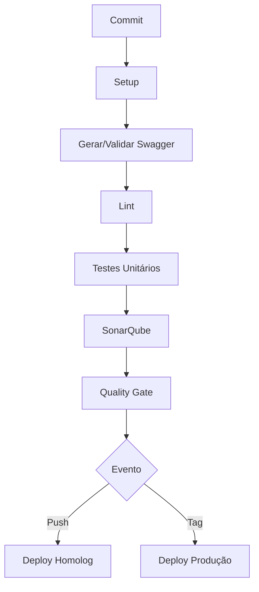

# OAS - Integração Swagger no Pipeline CI/CD

## Objetivo
Garantir a validação automática da documentação Swagger/OpenAPI durante o processo de CI/CD, assegurando consistência entre a documentação e a implementação da API.

## Pré-requisitos
1. Projeto Node.js com Swagger configurado
2. Dependências instaladas:
   ```bash
   npm install swagger-jsdoc swagger-ui-express swagger-cli
   ```
3. Arquivo de configuração Swagger (`swagger-config.js`) na raiz do projeto

---

## Passo a Passo de Implementação

### 1. Configuração do Swagger no Código
```javascript
// src/swagger.js
const swaggerJsdoc = require('swagger-jsdoc');
const swaggerUi = require('swagger-ui-express');

const options = {
  definition: {
    openapi: '3.0.0',
    info: {
      title: 'Calculadora API',
      version: '1.0.0',
    },
  },
  apis: ['./src/routes/*.js'], // Caminho para os arquivos de rotas
};

const specs = swaggerJsdoc(options);

module.exports = (app) => {
  app.use('/api-docs', swaggerUi.serve, swaggerUi.setup(specs));
  return specs;
};
```

### 2. Scripts Adicionais no package.json
```json
"scripts": {
  "generate:swagger": "node ./scripts/generate-swagger.js",
  "validate:swagger": "swagger-cli validate ./swagger.json"
}
```

### 3. Script de Geração do Swagger (`generate-swagger.js`)
```javascript
// scripts/generate-swagger.js
const fs = require('fs');
const swaggerSpec = require('../src/swagger')();

fs.writeFileSync('swagger.json', JSON.stringify(swaggerSpec, null, 2));
console.log('Swagger JSON gerado com sucesso!');
```

### 4. Configuração Atualizada do Pipeline (.drone.yml)

```yaml
steps:
  # ... etapas existentes de setup ...

  # Nova etapa: Geração e Validação do Swagger
  - name: Gerar e Validar Swagger
    commands:
      - npm run generate:swagger
      - npm run validate:swagger
      - cp swagger.json reports/swagger-${DRONE_COMMIT_SHA:0:8}.json  # Backup do relatório

  # ... etapas existentes de testes e quality gate ...

  # Atualização da etapa de deploy para incluir documentação
  - name: Deploy em Homologação
    commands:
      - pm2 start src/index.js --name calculadora-api-homolog
      - echo "Documentação disponível em: http://${HOMOLOG_URL}/api-docs"
    environment:
      HOMOLOG_URL: seu-servidor-homolog
    when:
      event: push
      branch: main
```

---

## Boas Práticas Implementadas

### 1. Validação Automática do Swagger
- Validação sintática do arquivo gerado usando `swagger-cli`
- Garante que o documento OpenAPI está bem formado antes do deploy

### 2. Versionamento da Documentação
- Backup do JSON gerado com hash do commit
- Histórico de versões disponível em `reports/`

### 3. Integração com Testes Existentes
- Execução paralela aos testes unitários
- Falha na geração/validação quebra o pipeline

### 4. Segurança da Documentação
- Documentação exposta apenas em ambientes não-produtivos
- Endpoint padrão protegido em produção (se necessário)

### 5. Monitoramento
- Adicione verificação da documentação no health check:
  ```javascript
  // Exemplo de rota de health check
  app.get('/health', (req, res) => {
    res.json({
      status: 'UP',
      docs: '/api-docs'
    });
  });
  ```

---

## Fluxo do Pipeline Atualizado



## Validações Adicionais Recomendadas

1. **Testes de Contrato**:
   ```javascript
   // Exemplo usando Jest + SuperTest
   const request = require('supertest');
   const app = require('../app');
   const swaggerSpec = require('./swagger')();

   describe('Swagger Contract Tests', () => {
     it('deve atender à especificação OpenAPI', async () => {
       const res = await request(app).get('/api-docs-json');
       expect(res.status).toBe(200);
       
       // Comparação com a especificação gerada
       expect(res.body).toMatchObject(swaggerSpec);
     });
   });
   ```

2. **Monitoramento de Endpoints**:
   - Verificar rotas não documentadas usando custom middleware
   - Alertar sobre endpoints faltantes no Swagger

3. **Versionamento Semântico**:
   - Atualização automática da versão no Swagger baseada em tags do Git
   ```bash
   npm pkg set version=$(git describe --tags --abbrev=0)
   ```

4. **Armazenamento de Documentação**:
   - Publicar JSON gerado em repositório dedicado
   - Integração com SwaggerHub ou Redocly

Esta implementação garante que sua documentação esteja sempre sincronizada com o código, validada a cada alteração e disponível para consumo durante todo o ciclo de desenvolvimento. A validação do Swagger como parte do pipeline reduz erros de documentação e melhora a qualidade da API.