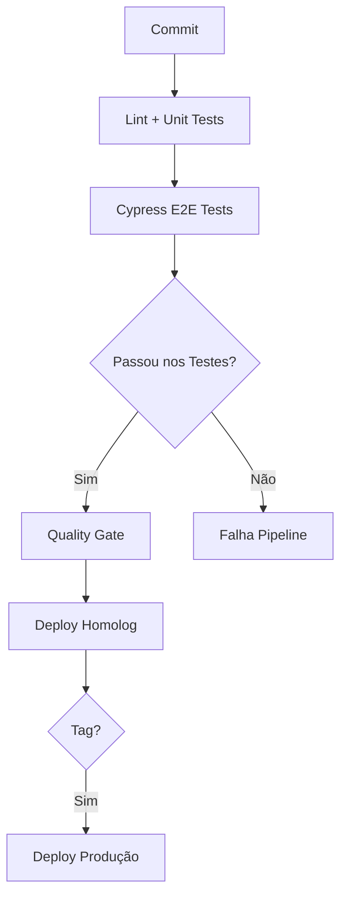

---

### **Documentação: Integração de Testes Cypress no Pipeline CI/CD com Drone**  
**Arquivo:** `qa_testjs_cypress.md`  

---

### **1. Pré-requisitos**
- **Cypress** instalado no projeto (`npm install cypress --save-dev`)
- **Servidor de Homologação** dedicado para testes E2E
- **Variáveis de Ambiente** configuradas no Drone:
  - `CYPRESS_BASE_URL`: URL da aplicação em homologação
  - `CYPRESS_RECORD_KEY` (opcional): Chave para Cypress Dashboard
  - `CYPRESS_CI_ENV`: Ambiente de execução (ex: `homolog`)

---

### **2. Adaptações na Estrutura DevOps**
#### **2.1. Organização do Projeto**
```bash
cypress/
├── e2e/
│   ├── features/
│   ├── specs/
├── fixtures/
├── plugins/
├── support/
├── videos/         # Gerado durante execução
├── screenshots/    # Gerado durante execução
drone.yml           # Pipeline atualizado
```

#### **2.2. Configuração Cypress (`cypress.config.js`)**
```javascript
const { defineConfig } = require('cypress');

module.exports = defineConfig({
  e2e: {
    baseUrl: process.env.CYPRESS_BASE_URL,
    video: true,
    screenshotOnRunFailure: true,
    env: {
      environment: process.env.CYPRESS_CI_ENV || 'dev'
    }
  }
});
```

---

### **3. Pipeline Drone Atualizado**
```yaml
# drone.yml (trechos relevantes)

steps:
  # ... (etapas anteriores de lint e unit tests) ...

  - name: Executar Testes E2E com Cypress
    environment:
      CYPRESS_BASE_URL: "http://homolog-server/app"
      CYPRESS_CI_ENV: "homolog"
      CYPRESS_RECORD_KEY:
        from_secret: CYPRESS_RECORD_KEY
    commands:
      - npx cypress run --browser chrome --headless --record
      - mv cypress/videos reports/cypress-videos
      - mv cypress/screenshots reports/cypress-screenshots
    when:
      event: [push, pull_request, tag]

  # ... (Quality Gate e SonarQube) ...

  - name: Deploy em Homologação
    # Adicionar verificação de resultados do Cypress
    commands:
      - set -e
      - if grep -q "FAILED" reports/cypress-summary.txt; then exit 1; fi
      - echo ">>> Iniciando deploy para HOMOLOGAÇÃO..."
      # ... (comandos de deploy existentes)
```

---

### **4. Melhores Práticas de QA para Implementação**
#### **4.1. Estratégia de Testes**
- **Critérios de Aceite Obrigatórios**:
  ```gherkin
  Scenario: Bloquear pipeline em falhas críticas
    Given Um teste Cypress falha com tag @critical
    Then O pipeline deve ser interrompido
    And O deploy não deve ser executado
  ```

#### **4.2. Gerenciamento de Resultados**
- **Relatórios Automatizados**:
  - Gerar relatório JUnit:
    ```bash
    npx cypress run --reporter junit --reporter-options "mochaFile=reports/cypress-report.xml"
    ```
- **Armazenamento de Artefatos**:
  ```yaml
  # drone.yml (adicione após execução do Cypress)
  - name: Publicar Relatórios
    commands:
      - tar -czvf cypress-reports.tar.gz reports/
    when:
      status: [success, failure]
  ```

#### **4.3. Otimizações de Performance**
```yaml
# drone.yml (parallelização)
- name: Cypress (Componentes Críticos)
  commands: npx cypress run --spec "cypress/e2e/critical/*.spec.js"

- name: Cypress (Demais Funcionalidades)
  commands: npx cypress run --spec "cypress/e2e/non-critical/*.spec.js"
```

---

### **5. Fluxo de Qualidade no Pipeline**


---

### **6. Tratamento de Falhas**
#### **6.1. Notificações**
```yaml
# drone.yml (notificação no Slack)
- name: Notificar Falha
  image: plugins/slack
  settings:
    webhook:
      from_secret: SLACK_WEBHOOK
    template: >
      Cypress Falhou em ${DRONE_BUILD_NUMBER} 
      Erros: ${DRONE_BUILD_STATUS}
  when:
    status: failure
```

#### **6.2. Revisão de Falhas**
- Acessar relatórios em `/reports/cypress-screenshots`
- Verificar vídeos em `/reports/cypress-videos`
- Priorizar falhas com tag `@critical`

---

### **7. Validação Pós-Implantação**
```yaml
- name: Smoke Test Pós-Deploy
  commands:
    - npx cypress run --env post_deploy=true --spec "cypress/e2e/smoke/*.spec.js"
  when:
    event: [push, tag]
```

---

### **8. Checklist de Qualidade**
- [ ] Testes rodam em ambiente isolado
- [ ] Falhas críticas bloqueiam deploy
- [ ] Relatórios persistidos por 30 dias
- [ ] Screenshots/vídeos gerados em falhas
- [ ] Dados sensíveis isolados em secrets
- [ ] Smoke tests pós-deploy implementados

---

### **9. Referências Recomendadas**
1. [Documentação Oficial Cypress CI](https://docs.cypress.io/guides/continuous-integration/introduction)
2. [Drone Pipeline Syntax](https://docs.drone.io/pipeline/overview/)
3. [Boas Práticas QA em Pipelines](https://www.cypress.io/blog/2020/02/12/run-cypress-with-a-single-docker-command/)

Esta implementação garante **feedback rápido**, **rastreabilidade completa** e **qualidade contínua**, alinhada com os princípios de Shift-Left Testing e DevOps.